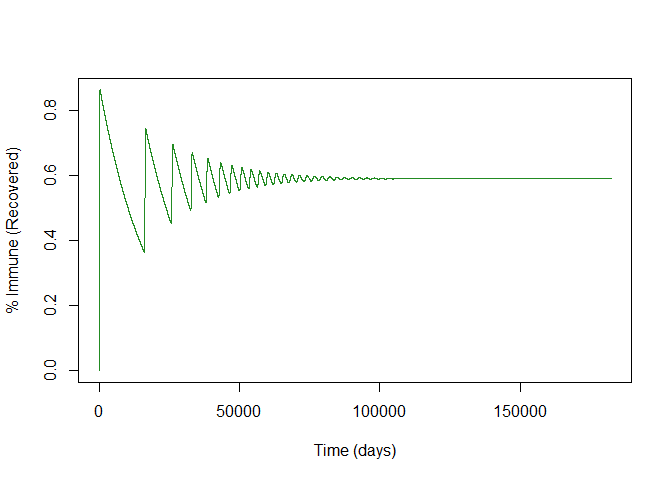

Lab Report 11
================
Chee Kay Cheong
2023-04-05

``` r
knitr::opts_chunk$set(message = FALSE, warning = FALSE)

library(tidyverse)
library(deSolve)
```

# Part 1 Model Dynamics

### Q1: Set up the code for the mosquito-borne disease model using the equations in Slide 5 and run the model using parameters/initial conditions in Slide 6, for 500 years.

Mosquito-borne disease model:

``` r
SIRMosVec = function(t, state, parameters) {
  with(as.list(c(state, parameters)), {
    
    dSH = vH - r*THM*SH*IM - muH*SH
    dIH = r*THM*SH*IM - gamma*IH - muH*IH
    
    dSM = vM - r*TMH*SM*IH - muM*SM
    dIM = r*TMH*SM*IH - muM*IM
    
    list(c(dSH, dIH, dSM, dIM))
  })
}
```

Initial conditions and parameters:

``` r
NH = 1e7; # human population size
IH = 1; # initial number of infection in humans
SH = NH - IH; # initial susceptible people
muH = 1/50/365; # human mortality rate in days, human life span: 50 yr
vH = NH*muH; # number of newborns per day
TMH = 0.2; # prob infection from human to mosquito;
THM = 0.1; # prob infection from mosquito to human;
gamma = 1/7; # infectious period: 7 days
NM = 1e8; # mosquito population size
IM = 1; # initial number of infection in mosquitoes
SM = NM - IM; # initial susceptible mosquitoes
muM = 1/7; # mosquito mortality rate, 1 week life span for mosquito
vM = NM*muM; # births in mosquito population
b = 0.5; # number of bite per mosquito per day;
r = b/NH; # bite rate per human per mosquito

parameters = c(muH = muH, muM = muM, vH = vH, vM = vM, THM = THM, TMH = TMH, gamma = gamma, r = b/NH)

state = c(SH = SH, IH = 1, SM = SM, IM = 1)

times = 1:(365*500);
```

Run the model.

``` r
sim = ode(y = state, times = times, func = SIRMosVec, parms = parameters)
```

### Q2: What are the peak (i.e. maximum) prevalence values for human and mosquitoes?

``` r
max(sim[ , 'IH'])
```

    ## [1] 1103855

``` r
max(sim[ , 'IM'])
```

    ## [1] 6857096

### Q3: What is the prevalence of infection for human at equilibrium?

``` r
tail(sim[ , 'IH'], 1)
```

    ## [1] 2268.589

### Q4: Plot the % immune to infection in humans vs. time.

``` r
RH = NH - sim[ , 'SH'] - sim[ , 'IH']
RH_frac = RH/NH

plot(x = sim[, 'time'], y = RH_frac, ylab = '% Immune (Recovered)', xlab = 'Time (days)', type = 'l', col = 'forestgreen', lwd = 1)
```

<!-- -->

# Part 2 Factors shaping the model Dynamics

### Q5: What is the R0 for this example?

``` r
R0 = (b*THM)/(muM) * (b*TMH*NM)/((gamma+muH)*NH)
```

### Q6: For an SIR model with birth and death, the population susceptibility at equilibrium equals the inverse of R0. Check the human population susceptibility at equilibrium in your mosquito-borne disease model simulation.

Does the equation S\*/N = 1/R0 hold for this model?

``` r
tail(sim[ , 'SH'], 1)/NH 
```

    ## [1] 0.4083753

``` r
1/R0
```

    ## [1] 0.4083198
